### Challenge

To complete this challenge, send a transaction from the owner's account.

```
pragma solidity ^0.4.21;

contract AccountTakeoverChallenge {
    address owner = 0x6B477781b0e68031109f21887e6B5afEAaEB002b;
    bool public isComplete;

    function authenticate() public {
        require(msg.sender == owner);

        isComplete = true;
    }
}
```
### Solution

* This challenge isn’t exactly a smart contract exploit challenge.
* Examine two transaction hashes (`0xd79fc80e7b787802602f3317b7fe67765c14a7d40c3e0dcb266e63657f881396` and `0x061bf0b4b5fdb64ac475795e9bc5a3978f985919ce6747ce2cfbbcaccaf51009`) of address `0x6B477781b0e68031109f21887e6B5afEAaEB002b`

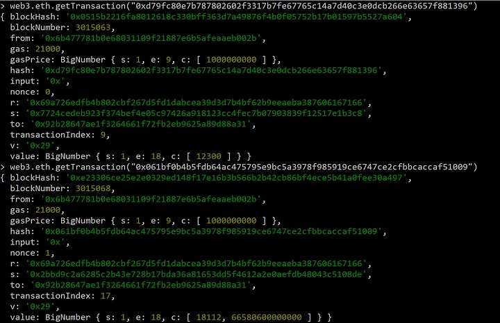

* Here you can see, r, an ECDSA signature output, which is supposed to be unique with each transaction reused here. This is the exploit vector.

>In fact was noticed in the wild as far back as 2013 (https://bitcointalk.to/index.php?topic=271486.0) in the blockchain space. Basically, r-values are to be generated using a random nonce k; However, there were mobile wallets using Android cryptographic libraries which ended up reusing k-values, in turn generating the same r-values across different transactions. This allows the private keys of the addresses to be derived from the signature outputs, resulting in stolen funds.

>Reusing the nonce k landed Sony into trouble during 2010: https://www.bbc.co.uk/news/technology-12116051. RFC6979 was later introduced during 2013 to allow deterministic generation of nonce k (hence helping with testing and environments with potentially unreliable PRNG).

#### Approach to get private key for `0x6B477781b0e68031109f21887e6B5afEAaEB002b`

```
# For txid 1: 0x061bf0b4b5fdb64ac475795e9bc5a3978f985919ce6747ce2cfbbcaccaf51009
s1 = 0x2bbd9c2a6285c2b43e728b17bda36a81653dd5f4612a2e0aefdb48043c5108de
z1 = 0x4f6a8370a435a27724bbc163419042d71b6dcbeb61c060cc6816cda93f57860c
```

```
For txid 2: 0xd79fc80e7b787802602f3317b7fe67765c14a7d40c3e0dcb266e63657f881396
s2 = 0x7724cedeb923f374bef4e05c97426a918123cc4fec7b07903839f12517e1b3c8
z2 = 0x350f3ee8007d817fbd7349c477507f923c4682b3e69bd1df5fbb93b39beb1e04
```

```
# Common r value: 0x69a726edfb4b802cbf267d5fd1dabcea39d3d7b4bf62b9eeaeba387606167166
```

* There is a method to derive private keys where the nonce k is reused with the values above, using the Python script below

```
r  = 0x69a726edfb4b802cbf267d5fd1dabcea39d3d7b4bf62b9eeaeba387606167166

# txid: 0xd79fc80e7b787802602f3317b7fe67765c14a7d40c3e0dcb266e63657f881396
s2 = 0x7724cedeb923f374bef4e05c97426a918123cc4fec7b07903839f12517e1b3c8
z2 = 0x350f3ee8007d817fbd7349c477507f923c4682b3e69bd1df5fbb93b39beb1e04

# txid: 0x061bf0b4b5fdb64ac475795e9bc5a3978f985919ce6747ce2cfbbcaccaf51009
s1 = 0x2bbd9c2a6285c2b43e728b17bda36a81653dd5f4612a2e0aefdb48043c5108de
z1 = 0x4f6a8370a435a27724bbc163419042d71b6dcbeb61c060cc6816cda93f57860c

# prime order p
p = 0xfffffffffffffffffffffffffffffffebaaedce6af48a03bbfd25e8cd0364141

# based on Fermat's Little Theorem
# works only on prime n
def inverse_mod(a, n):
    return pow(a, n-2, n) 
    

k = (z1 - z2) * inverse_mod(s1 - s2, p) % p             # derive k for s1 - s2
pk = (s1 * k - z1) * inverse_mod(r, p) % p              # derive private key  
pkNeg = (-s1 * (-k % p) - z1) * inverse_mod(r, p) % p   # -k (mod p) of s1 - s2 == -s1 + s2, check -s1

print('k           = {:x}'.format(k))
print('k negation  = {:x}'.format(-k % p))
if pk == pkNeg:                                         # should not be false
    print('private key = {:x}'.format(pk))  

    
print('')


k = (z1 - z2) * inverse_mod(s1 + s2, p) % p             # derive k for s1 + s2
pk = (s1 * k - z1) * inverse_mod(r, p) % p              # derive private key    
pkNeg = (-s1 * (-k % p) - z1) * inverse_mod(r, p) % p   # -k (mod p) of s1 + s2 == -s1 - s2, double check -s1

print('k           = {:x}'.format(k))
print('k negation  = {:x}'.format(-k % p))
if pk == pkNeg:                                         # should not be false
    print('private key = {:x}'.format(pk))
```

* Output

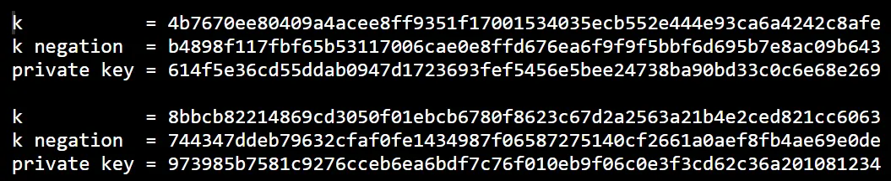

* Now , derive account address from each of the private key, one should give you `0x6B477781b0e68031109f21887e6B5afEAaEB002b`

#### Explanation of the above script

* An ECDSA signature s is computed using the below equation:

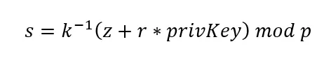

* Where 
 * `k` is the nonce, 
 * `z` is the message digest, 
 * `r` is the ECSDA signature, 
 * `privKey` is the private key, and 
 * `p` is the prime order of the `secp256k1` curve (being `0xfffffffffffffffffffffffffffffffebaaedce6af48a03bbfd25e8cd0364141`).

* Now, we can derive for s1 and s2:

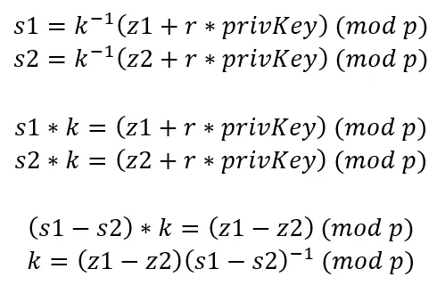

> All operations here are done modulo prime p, therefore `(s1-s2)^(-1)` is a modulo multiplicative inverse of prime p, which we could calculate using an implementation of Fermat’s Little Theorem as p is prime for this case, or alternatively the extended Euclidean algorithm.

* Once we have k, we could then try to find privKey:

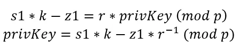

* And the private key privKey should also be the same when derived from s2 and z2.

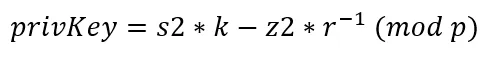

* Calculating for the case of s1-s2 isn’t sufficient, as we could also use a flipped s signature -s (mod p), which would still be a valid signature output. 
* Therefore preemptively, we would evaluate multiple k candidates (which there exists for each pair a negation of itself), so we could be looking at:

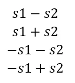

* Where -s1-s2 and -s1+s2 we could derive using -k (mod p).

* Now that we have all of these, we could implement these in code, plug in the values we have, and see what appears. Everything below will be implemented in Python.
* Here, we are going with Fermat’s Little Theorem for the modulo multiplicative inverse (def inverse_mod):

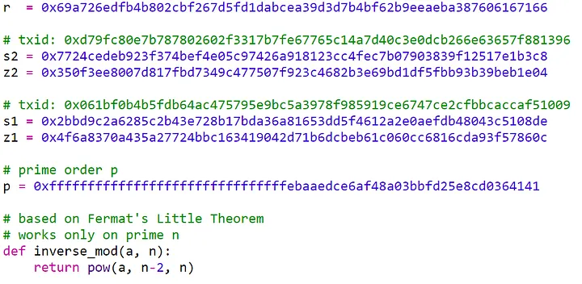

* Finding k:

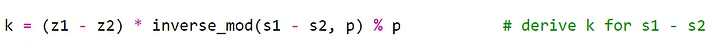

* Deriving private key for k and -k (mod p).

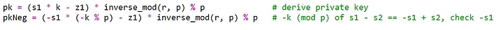

* Printing all k candidates and making sure the private keys matches:

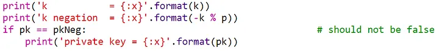

* We will also do the same for s1+s2, replacing the s1-s2 used to calculate the k candidate, and deriving the private keys in a similar fashion. So the whole code block will be:


##### References
* [Account takeover](https://medium.com/coinmonks/smart-contract-exploits-part-3-featuring-capture-the-ether-accounts-c86d7e9a1400)
* [Recovering Pkey when someone uses same K twice](https://bitcoin.stackexchange.com/a/37762)
* [Recovering private key when someone uses the same k twice in ECDSA signatures](https://bitcoin.stackexchange.com/a/35850)