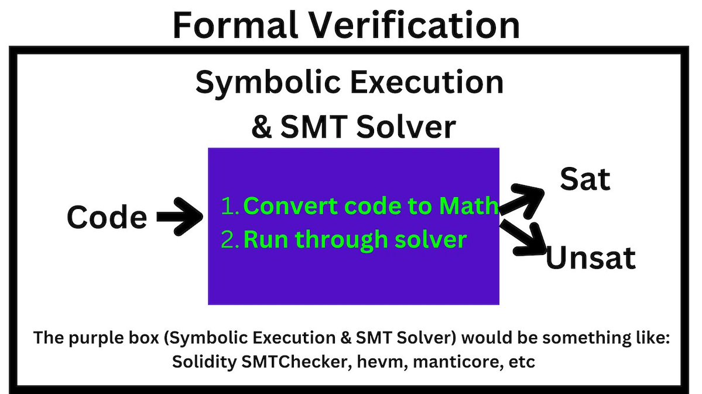
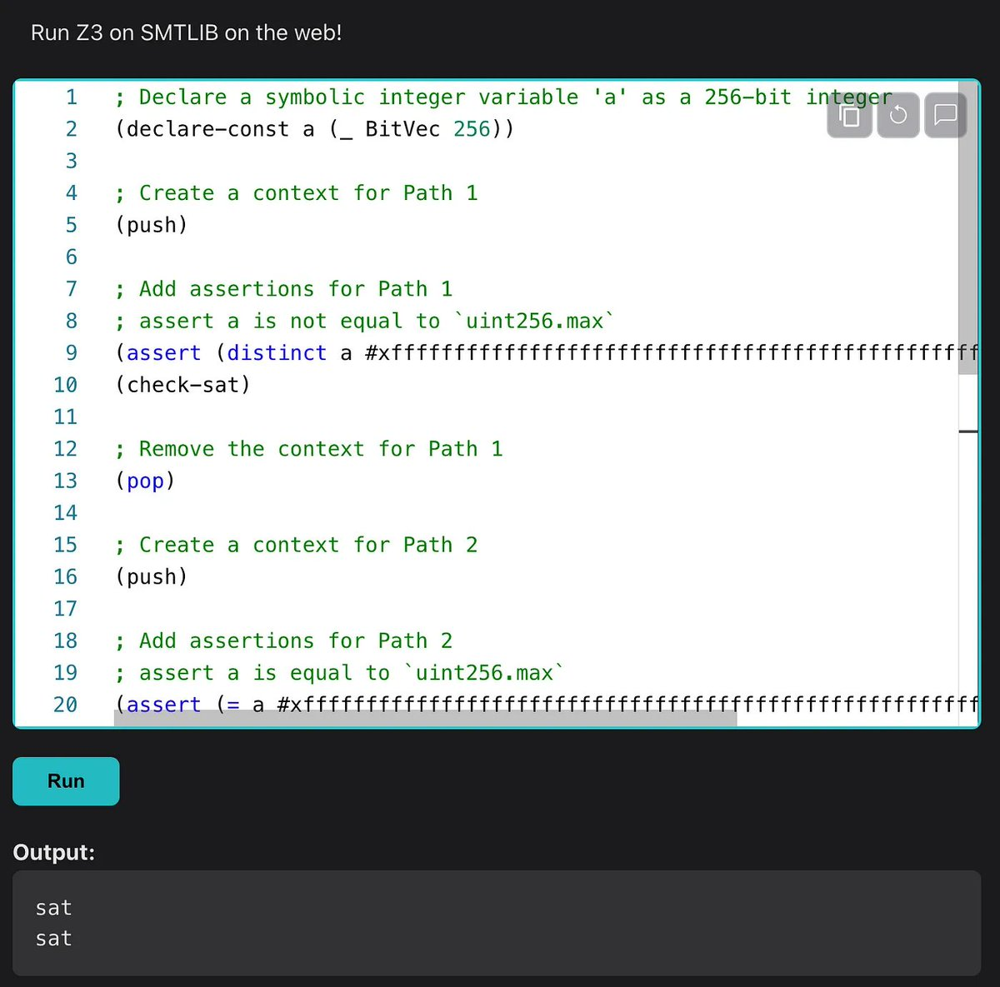

## Formal Verification

> from https://twitter.com/PatrickAlphaC/status/1651024851212050433?s=20

* **Definition :** The art of mathematically proving your code does 1 thing.

* There are many kinds of FV like abstract interpretation and symbolic execution (SE).

* **Definition:**

* **Symbolic Execution:** A technique for formal verification when a program:

1. Explores all paths

2. Converts paths -> a set of math expressions

* Then, we usually dump those expressions into an SAT/SMT Solver to "prove" your code does something.



* Let's say we want to prove some function can never revert. This would be helpful if we wanted to prove that users could always withdraw their money. Let's using the function `f` as an example.

```
// SPDX-License-Identifier: MIT

pragma solidity ^0.8.16;

contract SmallSol {
    // Invariant: Must never revert
    function fuint256 a) public returns (uint256) {
        a = a + 1;
        return a;
    }
}
```

* Step 1 is to explore all the paths. We can use a tool like the Solidity SMTChecker, @CertoraInc, Manticore, HEVM, etc to explore all the paths this function can take.

* We can see ~2 paths.
1. The function returns by adding 1 to a
2. The function reverts if a is the max `uint256`

* These tools would do it automagically, but we are just eyeballing for now. Once we have the paths, we convert them to a set of expressions, like booleans.

```
Path 1:
a < type(uint256).max

Path 2:
a == type(uint256).max
a + 1 < a
```

* We then can dump these into a SAT solver

* You can think of a SAT Solver as a black box that looks for an example that makes all your booleans true.

For example, if our booeans were:

A == False
A == True

Our SAT Solver would say this set of booleans is unsatisfiable, there is no A that makes these booleans work.

* One of the most common SAT solvers is the Z3 solver, which uses a special language to represent the booleans.

You can see an example of me uploading the Paths of our code here to Z3.

You'll notice it has "sat" and "sat" as it's output.



* Since our solves gave us 2 "sat"s it means it was able to find an A input to make our paths solvable.

Path 2 is what we were trying to prove couldn't happen, and our sat solver says it was able to prove that Path 2 can happen, so we know our code has an issue!

* You can do this entire process of:

1. Explore Paths
2. Convert to Booleans
3. Upload to SAT solver

With just your @solidity_lang compiler using its SMTChecker built-in

```
patrick@iMac: [trail-of-bits-interview] $ solc -model-checker-engine chc --model-checker-targets assert SmallSol.sol
Warning: Function state mutability can be restricted to pure
    --> SmallSol. sol:9:5:
        function f(uint256 a) public returns (uint256) {
        ^ (Relevant source part starts here and spans across multiple lines).

Warning: CHC: Assertion violation happens here.
Counterexample:
a = 1
  = 0

Transaction trace:
SmallSol. constructor ( )
SmallSol. f(0)
--> SmallSol. sol: 11:9:
assert(a != 1);
^^^^^^^^^^^^^^
```

 * Is this a silver bullet?

No.

In practice, doing this process is very time intensive, and more often than not a sufficiently powerful fuzzer will find the same edge cases in MUCH less time.

* Read more mandatory : https://hackmd.io/@SaferMaker/EVM-Sym-Exec